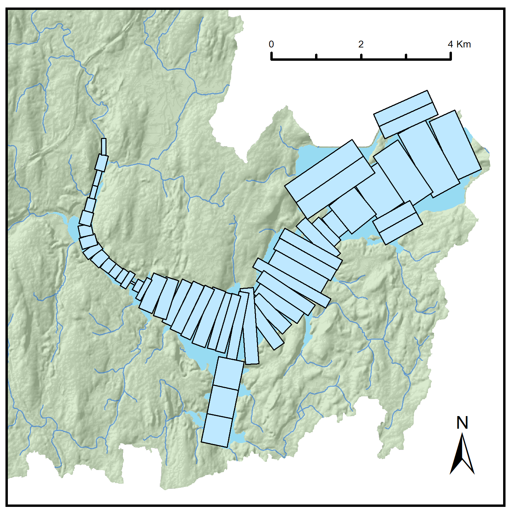

# Overview
calib.py is a script that allows for the automatic calibration of the CE-QUAL-W2 Wachusett Reservoir water quality model. It utilizes the [jMetalpy](https://github.com/jMetal/jMetalPy) framework and is currently set up for calibration using multi-objective optimization using the NSGA-II genetic algorithm. In its current state, it has the capacity to calibrate water quality models for temperature and specific conductivity but may be extended for other water quality constituents and eventually, other CE-QUAL-W2 models, as necessary.
  

## Getting Started
Download instructions
1. Clone this repository:
```
git clone 'blah blah blah'
```
2. Download the jMetalPy using the pip command
```
pip install jmetalpy
```
Given the computational demand associated with calibrating the CE-QUAL-W2 models, use of the UMass GHPCC cluster is recommended for multi-year models. A separate Linux executable must be compiled for the calibration of CE-QUAL-W2 models on Linux machines. This compilation procedure and documentation is provided [here](https://github.com/WQDSS/CE-QUAL-W2-Linux).

## Calibration
Several edits need to be made to the file directories and calibration routine prior to running the optimization.
#### Model definitions
1. Update model execution files (e.g. "w2_v4_64.exe") in main directory to your most recent model version
2. Copy and paste baseline model into new model year and "init" for example:
  ```
  mkdir ./[model year]/init
  ```
3. Add observations for Basin North and Cosgrove Intake into "data" directory. Make sure data format is in agreement with previous model years. The routine will not work if the data are not formatted properly.
#### Calibration file "calib.py"
The current script is set to calibrate for temperature (T) and specific conductivity (SC) at the Basin North (BN) and the Cosgrove Intake (CI). For calibration of model years prior to 2016, it is recommended that the SC objective at the CI be dropped due to probe measurement errors. The model parameters (decision variables) selected for calibration and corresponding bounds are defined in the problem initiation and provided below:

<!-- $Minimize$ $f_m(x)$ &nbsp;&nbsp;&nbsp;&nbsp;&nbsp;&nbsp;$m = 1,2,...,M$
$s.t.$&nbsp;&nbsp;&nbsp;&nbsp;&nbsp;&nbsp; $x_{lower,i} \le x_i \le x_{upper,i} $ -->

Table 1. Summary of model parameters used in calibration

|Parameter Name  | Parameter Abbr. | Lower Bound | Upper Bound |
|:-:|:-:|:-:|:-:|:-:|
| Light extinction coefficient | EXH20 | 0.25 | 0.65 |
| CI withdrawal elevation | ESTR | 104.3 | 110.6 |
| WSC Thomas | WSC | 0.5 | 1.0 |
| WSC South | WSC | 0.5 | 1.0 |
| WSC North  | WSC | 0.5 | 1.0 |

The algorithm will seek to find the optimal parameter set from Table 1. that forms the pareto front. The objective function is set to minimize RMSE for each objective

##### Script Parameters


### Notes
jMetalPy is an actively managed package. Frequent updates may occur that change the naming/placement of several function locations.

Updated observer modules to print objectives not defined in formula
